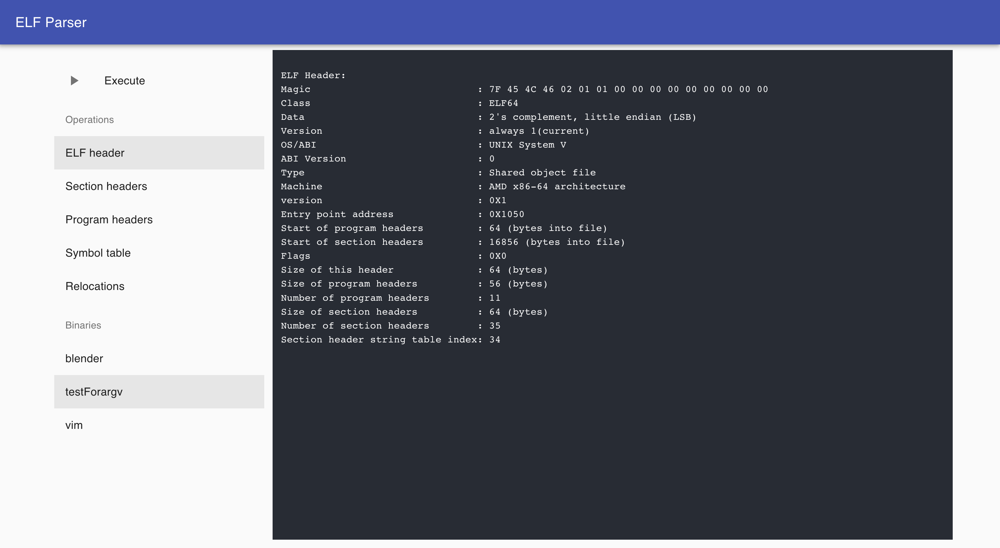
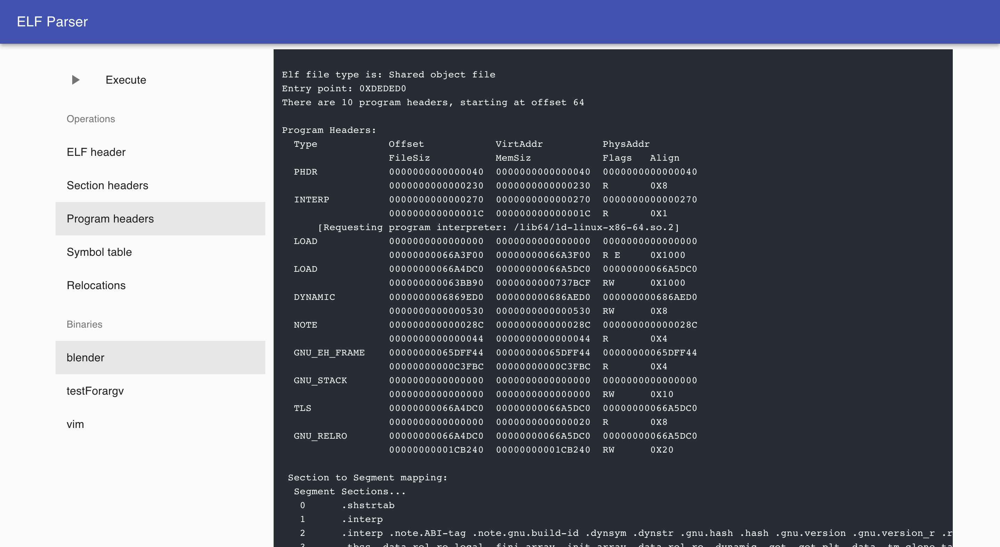
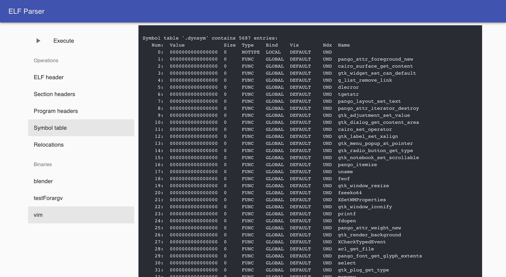

# ELF-Visualization

一个在浏览器中可视化展示 ELF 文件结构的工具：用 C 解析 ELF（文件头、段表、程序头、符号表、重定位等），前端用 Next.js + Material-UI，将解析结果以流式文本呈现。





## 更新信息（2025-12-16）
- 规范统一为只使用 `npm`，不使用 Yarn；锁文件以 `package-lock.json` 为准
- 环境与版本：
  - macOS（Apple Silicon）
  - 全局 Node `v23.7.0`
  - 项目内通过 `nvm` 使用 Node `v16.20.2`（见 `.nvmrc`）
- 修改原因：
  - Node 14 在 Apple Silicon 上通过 `nvm install 14` 源码编译 V8 易失败，因此在本机采用 Node 16 验证运行
  - 历史 `package-lock.json` 指向 `registry.npm.taobao.org` 会触发证书过期错误，已改用官方源并重建锁
  - 旧版文档保留至 `README_legacy.md`

## 快速开始
- 启动地址：`http://localhost:3000/`
- 放置待解析文件：将 ELF 文件放到 `binaries/` 目录
- 在页面左侧选择操作（`-h/-S/-l/-s/-r`）与文件，点击 Execute，右侧显示解析输出

## 环境准备
- 安装 nvm（如未安装）：
  ```
  curl -o- https://raw.githubusercontent.com/nvm-sh/nvm/v0.39.7/install.sh | bash
  export NVM_DIR="$HOME/.nvm"
  . "$NVM_DIR/nvm.sh"
  ```
- 切换 Node 版本：
  ```
  nvm use
  node -v
  ```
  建议显示为 `v16.x`

## 安装与运行
1) 安装依赖（使用官方 npm registry）：
   ```
   npm config set registry https://registry.npmjs.org/
   npm install
   ```
2) 编译本地解析器：
   ```
   gcc elf_parser.c -o elf_parser
   ```
3) 启动开发服务器：
   ```
   npm run dev
   ```
   然后打开 `http://localhost:3000/`

## 包管理器规范
- 仅使用 `npm`，不使用 Yarn
- 开发安装：`npm install`
- CI/自动化：`npm ci`（严格按照 `package-lock.json` 安装）

## 目录说明
- 项目根目录即可运行；旧文档中的 `cd elfviewer` 已过时

## License
[MIT](https://github.com/wwyqianqian/ELF-Visualization/blob/main/LICENSE) © wwyqianqian
