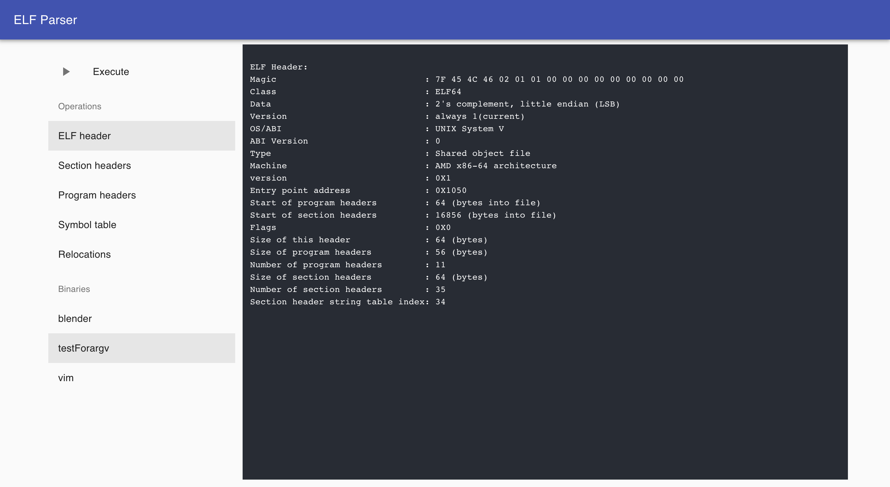
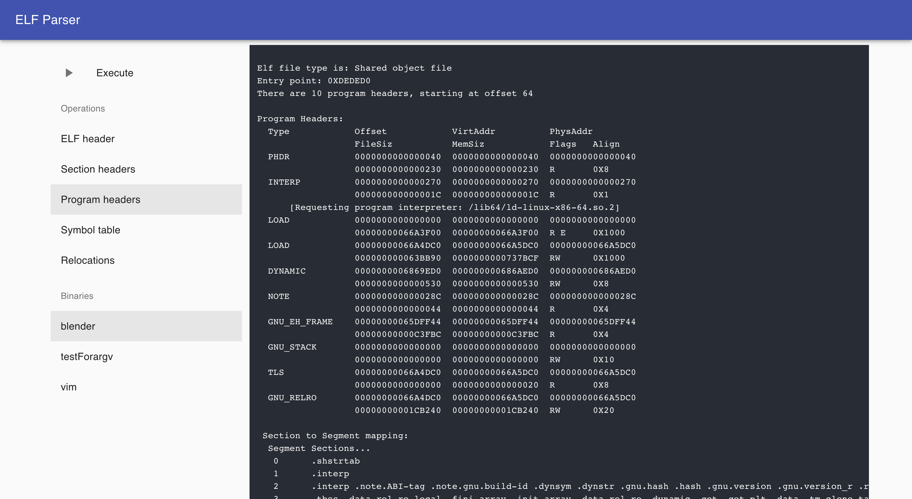
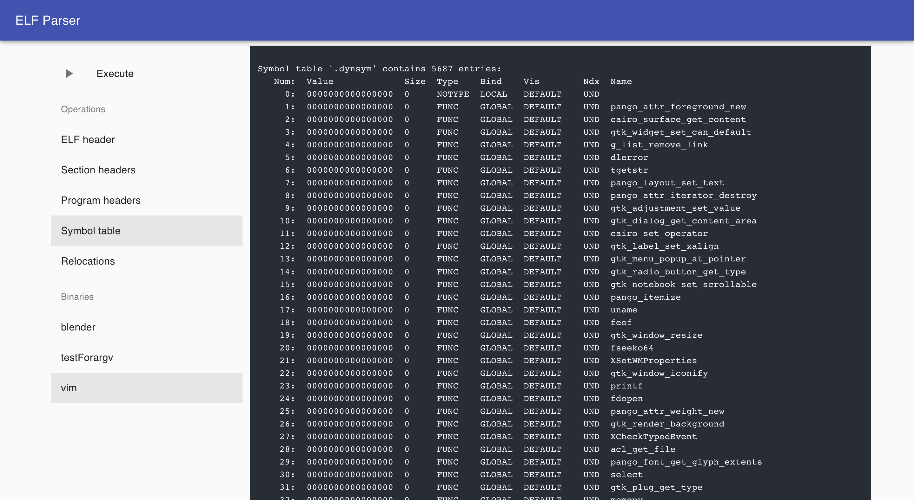

# ELF-Visualization
A `readelf`-like tool for macOS. Then stream the output to any browser. Run on `http://localhost:3000`.
## Install
This project uses `GCC` , `nvm`, and `Node.js@v14.0.0`. Go check them out if you don't have them locally installed.
```
brew install gcc
curl -o- https://raw.githubusercontent.com/nvm-sh/nvm/v0.37.2/install.sh | bash
nvm install v14
nvm use v14
```
## Usage
```
cd elfviewer
npm install || yarn install
npm run dev || yarn dev
```
Then move to `http://localhost:3000`.
Note Bene: `npm run dev` do not work in the fish shell. Pleace change to zsh or bash(e.g.).

## Running screenshot




## Contributors
Thanks to all the people who contribute. Feel free to dive in! Open an issue or submit PRs.
[@wwyqianqian](https://github.com/wwyqianqian/)

## License
[MIT](https://github.com/wwyqianqian/ELF-Visualization/blob/main/LICENSE) © wwyqianqian
